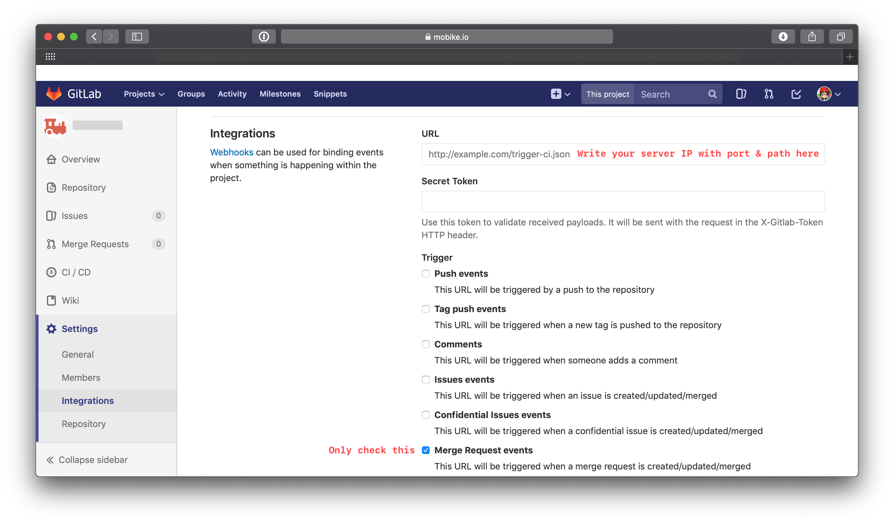

# gitlab-mr-jira-issue-trigger

English | [中文](README_CN.md)

A GitLab merge request webhook to trigger Jira issue transition.

## What

This is a webhook for connection of GitLab and Jira.

> Inspired by [shyiko/gitlab-ci-build-on-merge-request](https://github.com/shyiko/gitlab-ci-build-on-merge-request).

## How to run?

### Server Settings

- Build & Run

```shell
git clone https://github.com/kingcos/gitlab-mr-jira-issue-trigger.git
cd gitlab-mr-jira-issue-trigger

go build gitlab-mr-jira-issue-trigger
./gitlab-mr-jira-issue-trigger --path <CONFIG_YAML_FILE_PATH(Default is `config.yml`)>
```

- Docker(Recommended)

```shell
docker pull kingcos/gitlab-mr-jira-issue-trigger:0.1.0

docker run -it --rm --name gitlab-mr-jira-issue-trigger \
    kingcos/gitlab-mr-jira-issue-trigger:0.1.0 \
    gitlab-mr-jira-issue-trigger --path <CONFIG_YAML_FILE_PATH(Default is `config.yml`)>
```

### GitLab Webhook Settings

- Add server IP with port & path which you setup in config.yml in the GitLab - Settings - Integrations page:



- Click 'Add webhook' button
- You can test it with 'Merge requests events'

## Config

```yml
GitLab:
  host: GITLAB_HOST_ADDRESS (REQUIRED)
  token: GITLAB_PUBLIC_USER_TOKEN (REQUIRED)

Jira:
  host: JIRA_HOST_ADDRESS (REQUIRED)
  username: JIRA_PUBLIC_USERNAME (REQUIRED)
  password: JIRA_PUBLIC_PASSWORD (REQUIRED)

Server:
  path: WEBHOOK_SERVER_PATH (REQUIRED)
  port: WEBHOOK_SERVER_PORT (REQUIRED)

Trigger:
  regex: REGEX_FOR_MATCH_JIRA_ISSUE_IDS_IN_GITLAB_MERGE_REQUEST_TITLE
  opened:
    title: JIRA_TRANSITION_TITLE_IN_THE_PAGE
    message: JIRA_ISSUE_MESSAGE
    url: SHOULD_INCLUDED_GITLAB_MERGEREQUEST_URL
    date: SHOULD_INCLUDED_GITLAB_MERGEREQUEST_DATE
    username: SHOULD_INCLUDED_GITLAB_MERGEREQUEST_USERNAME
  merged:
    title: JIRA_TRANSITION_TITLE_IN_THE_PAGE
    message: JIRA_ISSUE_MESSAGE
    url: SHOULD_INCLUDED_GITLAB_MERGEREQUEST_URL
    date: SHOULD_INCLUDED_GITLAB_MERGEREQUEST_DATE
    username: SHOULD_INCLUDED_GITLAB_MERGEREQUEST_USERNAME
  closed:
    title: JIRA_TRANSITION_TITLE_IN_THE_PAGE
    message: JIRA_ISSUE_MESSAGE
    url: SHOULD_INCLUDED_GITLAB_MERGEREQUEST_URL
    date: SHOULD_INCLUDED_GITLAB_MERGEREQUEST_DATE
    username: SHOULD_INCLUDED_GITLAB_MERGEREQUEST_USERNAME
  locked:
    title: JIRA_TRANSITION_TITLE_IN_THE_PAGE
    message: JIRA_ISSUE_MESSAGE
    url: SHOULD_INCLUDED_GITLAB_MERGEREQUEST_URL
    date: SHOULD_INCLUDED_GITLAB_MERGEREQUEST_DATE
    username: SHOULD_INCLUDED_GITLAB_MERGEREQUEST_USERNAME
```

## Issues

- If you find bugs, please **issue** me
- If you want to contribute, please **pull request**
- If you like it, just **star** 🌟 it

## Reference

- [Jira API 7.9.0](https://docs.atlassian.com/software/jira/docs/api/REST/7.9.0)
- [GitLab WebHook API - Merge Request Events](https://docs.gitlab.com/ee/user/project/integrations/webhooks.html#merge-request-events)
- [GitLab Notes API - Create new merge request note](https://docs.gitlab.com/ee/api/notes.html#create-new-merge-request-note)
